```python
import my_eMeL.data_loader as data_loader
import my_eMeL.my_eMeL as my_eMeL
```


```python
# Loading data
data   = data_loader.load_known_txt_V2(  file_path           = './data1.txt'
                                              , delimiter          = ','
                                              , data_column_asList = [0,1]   )
# Pre-processing data
data   = map(lambda x : [float(x[0]),float(x[1])] ,data)

#create Model
kmeans = my_eMeL.KMeans(n_clusters=3)
kmeans.savePlots = './Kmeans-data1-k3/'
kmeans.fit(data)
#--------------------------------------
#create Model
kmeans = my_eMeL.KMeans(n_clusters=7)
kmeans.savePlots = './Kmeans-data1-k7/'
kmeans.fit(data)
```

    /anaconda2/lib/python2.7/site-packages/matplotlib/cbook/deprecation.py:107: MatplotlibDeprecationWarning: Adding an axes using the same arguments as a previous axes currently reuses the earlier instance.  In a future version, a new instance will always be created and returned.  Meanwhile, this warning can be suppressed, and the future behavior ensured, by passing a unique label to each axes instance.
      warnings.warn(message, mplDeprecation, stacklevel=1)
    /anaconda2/lib/python2.7/site-packages/matplotlib/pyplot.py:537: RuntimeWarning: More than 20 figures have been opened. Figures created through the pyplot interface (`matplotlib.pyplot.figure`) are retained until explicitly closed and may consume too much memory. (To control this warning, see the rcParam `figure.max_open_warning`).
      max_open_warning, RuntimeWarning)


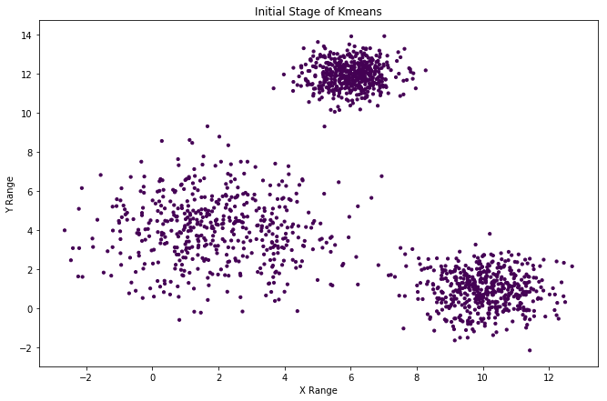


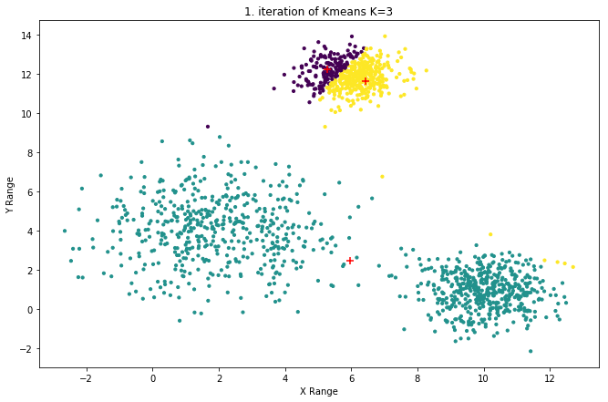


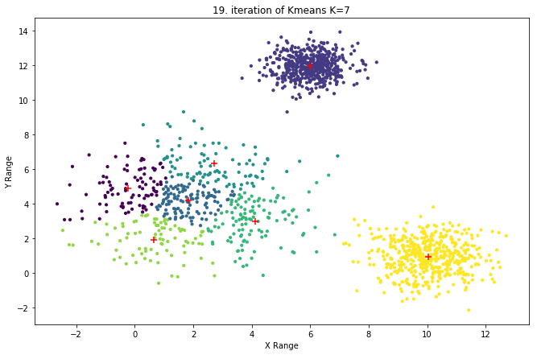


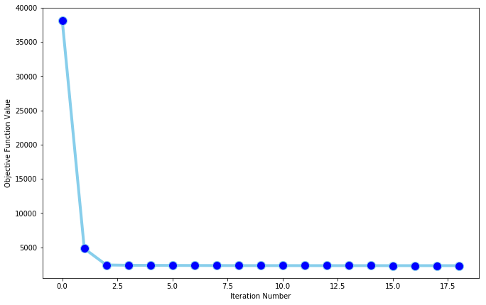


```python
# Loading data
data   = data_loader.load_known_txt_V2(  file_path           = './data2.txt'
                                              , delimiter          = ','
                                              , data_column_asList = [0,1]   )
# Pre-processing data
data   = map(lambda x : [float(x[0]),float(x[1])] ,data)

#create Model
kmeans = my_eMeL.KMeans(n_clusters=2)
kmeans.savePlots = './Kmeans-data2-k2/'
kmeans.fit(data)
#--------------------------------------
#create Model
kmeans = my_eMeL.KMeans(n_clusters=5)
kmeans.savePlots = './Kmeans-data2-k5/'
kmeans.fit(data)
```


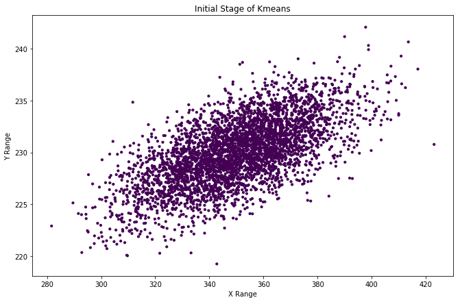


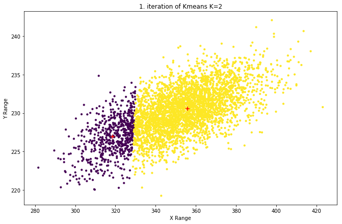


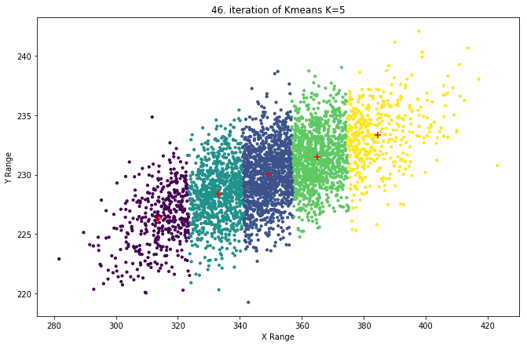


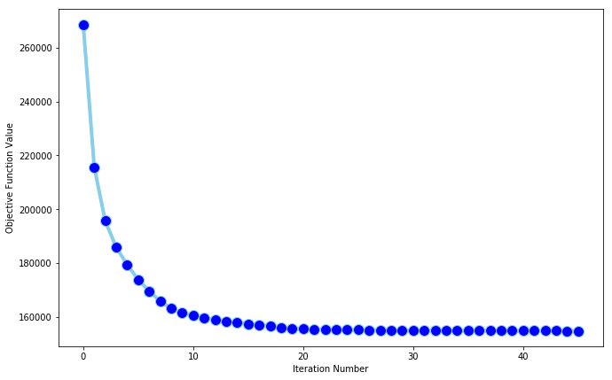


```python
# Loading data
data   = data_loader.load_known_txt_V2(  file_path           = './data3.txt'
                                              , delimiter          = ','
                                              , data_column_asList = [0,1]   )
# Pre-processing data
data   = map(lambda x : [float(x[0]),float(x[1])] ,data)

#create Model
kmeans = my_eMeL.KMeans(n_clusters=3)
kmeans.savePlots = './Kmeans-data3-k3/'
kmeans.fit(data)
#--------------------------------------
#create Model
kmeans = my_eMeL.KMeans(n_clusters=8)
kmeans.savePlots = './Kmeans-data3-k8/'
kmeans.fit(data)
```


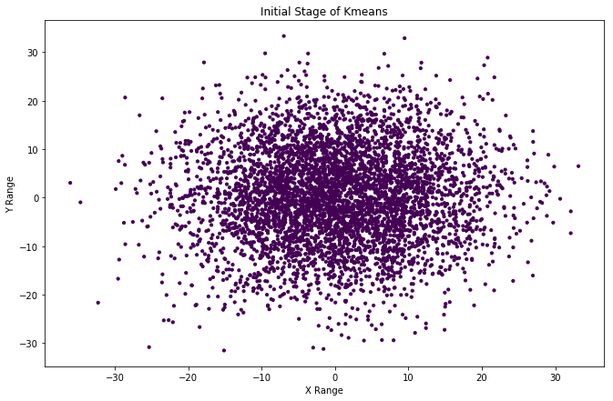


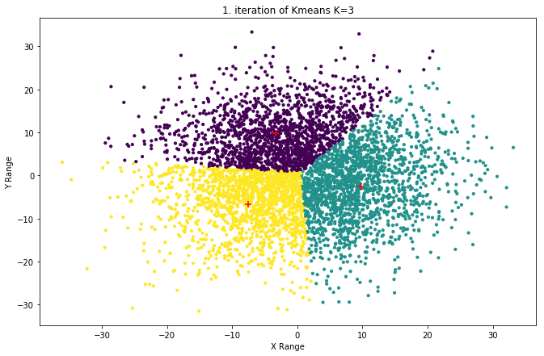


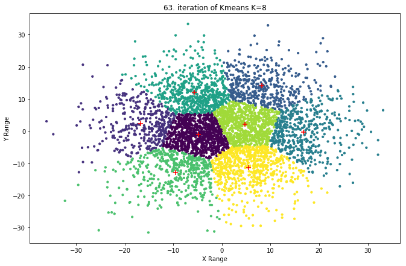


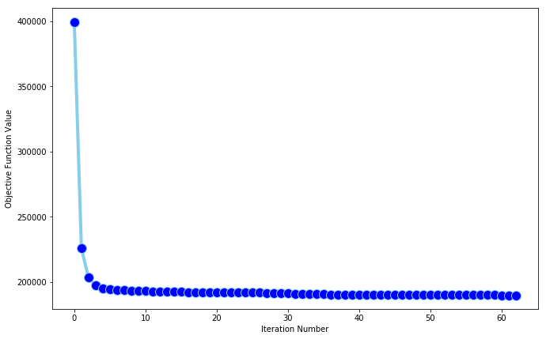

