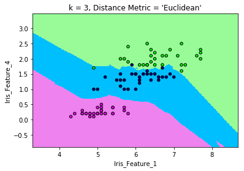
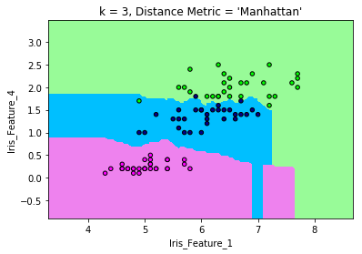
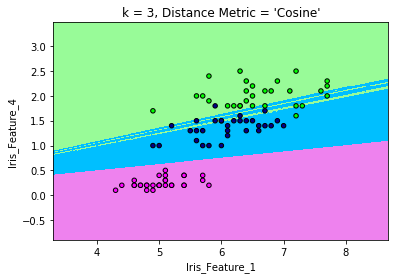
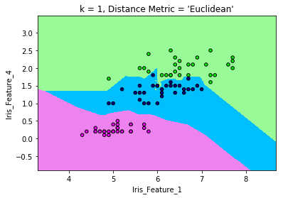

## Needed Libs
    For this lecture I started to develop a library.
    with using this lib all ML lecture can be coverted.
    with every assignment lib will grove


```python
import my_eMeL.my_eMeL as my_eMeL
import my_eMeL.data_loader as data_loader
```

### Reading data from a file
    Using the lib a data file can read very easly


```python
# import some known data
iris_data_df, iris_label_df = data_loader.load_known_txt( file_path    = './iris_data.txt',
                                                          delimiter    = ','   ,
                                                          data_column_asList  = [0,3] ,
                                                          label_column =  4     )      
```

#### Take a look to data


```python
from IPython.display import display_html 

df1_styler = iris_data_df[:10].style.set_table_attributes("style='display:inline'").set_caption('Data of Iris')
df2_styler = iris_label_df[:10].style.set_table_attributes("style='display:inline'").set_caption('Label of Iris')

display_html(df1_styler._repr_html_()+df2_styler._repr_html_(), raw=True)
```


<style  type="text/css" >
</style>  
<table id="T_34f0df3a_32f8_11e9_b8e6_8c85907aad61" style='display:inline'><caption>Data of Iris</caption> 
<thead>    <tr> 
        <th class="blank level0" ></th> 
        <th class="col_heading level0 col0" >col0</th> 
        <th class="col_heading level0 col1" >col3</th> 
    </tr></thead> 
<tbody>    <tr> 
        <th id="T_34f0df3a_32f8_11e9_b8e6_8c85907aad61level0_row0" class="row_heading level0 row0" >0</th> 
        <td id="T_34f0df3a_32f8_11e9_b8e6_8c85907aad61row0_col0" class="data row0 col0" >5.1</td> 
        <td id="T_34f0df3a_32f8_11e9_b8e6_8c85907aad61row0_col1" class="data row0 col1" >0.2</td> 
    </tr>    <tr> 
        <th id="T_34f0df3a_32f8_11e9_b8e6_8c85907aad61level0_row1" class="row_heading level0 row1" >1</th> 
        <td id="T_34f0df3a_32f8_11e9_b8e6_8c85907aad61row1_col0" class="data row1 col0" >4.9</td> 
        <td id="T_34f0df3a_32f8_11e9_b8e6_8c85907aad61row1_col1" class="data row1 col1" >0.2</td> 
    </tr>    <tr> 
        <th id="T_34f0df3a_32f8_11e9_b8e6_8c85907aad61level0_row2" class="row_heading level0 row2" >2</th> 
        <td id="T_34f0df3a_32f8_11e9_b8e6_8c85907aad61row2_col0" class="data row2 col0" >4.7</td> 
        <td id="T_34f0df3a_32f8_11e9_b8e6_8c85907aad61row2_col1" class="data row2 col1" >0.2</td> 
    </tr>    <tr> 
        <th id="T_34f0df3a_32f8_11e9_b8e6_8c85907aad61level0_row3" class="row_heading level0 row3" >3</th> 
        <td id="T_34f0df3a_32f8_11e9_b8e6_8c85907aad61row3_col0" class="data row3 col0" >4.6</td> 
        <td id="T_34f0df3a_32f8_11e9_b8e6_8c85907aad61row3_col1" class="data row3 col1" >0.2</td> 
    </tr>    <tr> 
        <th id="T_34f0df3a_32f8_11e9_b8e6_8c85907aad61level0_row4" class="row_heading level0 row4" >4</th> 
        <td id="T_34f0df3a_32f8_11e9_b8e6_8c85907aad61row4_col0" class="data row4 col0" >5.0</td> 
        <td id="T_34f0df3a_32f8_11e9_b8e6_8c85907aad61row4_col1" class="data row4 col1" >0.2</td> 
    </tr>    <tr> 
        <th id="T_34f0df3a_32f8_11e9_b8e6_8c85907aad61level0_row5" class="row_heading level0 row5" >5</th> 
        <td id="T_34f0df3a_32f8_11e9_b8e6_8c85907aad61row5_col0" class="data row5 col0" >5.4</td> 
        <td id="T_34f0df3a_32f8_11e9_b8e6_8c85907aad61row5_col1" class="data row5 col1" >0.4</td> 
    </tr>    <tr> 
        <th id="T_34f0df3a_32f8_11e9_b8e6_8c85907aad61level0_row6" class="row_heading level0 row6" >6</th> 
        <td id="T_34f0df3a_32f8_11e9_b8e6_8c85907aad61row6_col0" class="data row6 col0" >4.6</td> 
        <td id="T_34f0df3a_32f8_11e9_b8e6_8c85907aad61row6_col1" class="data row6 col1" >0.3</td> 
    </tr>    <tr> 
        <th id="T_34f0df3a_32f8_11e9_b8e6_8c85907aad61level0_row7" class="row_heading level0 row7" >7</th> 
        <td id="T_34f0df3a_32f8_11e9_b8e6_8c85907aad61row7_col0" class="data row7 col0" >5.0</td> 
        <td id="T_34f0df3a_32f8_11e9_b8e6_8c85907aad61row7_col1" class="data row7 col1" >0.2</td> 
    </tr>    <tr> 
        <th id="T_34f0df3a_32f8_11e9_b8e6_8c85907aad61level0_row8" class="row_heading level0 row8" >8</th> 
        <td id="T_34f0df3a_32f8_11e9_b8e6_8c85907aad61row8_col0" class="data row8 col0" >4.4</td> 
        <td id="T_34f0df3a_32f8_11e9_b8e6_8c85907aad61row8_col1" class="data row8 col1" >0.2</td> 
    </tr>    <tr> 
        <th id="T_34f0df3a_32f8_11e9_b8e6_8c85907aad61level0_row9" class="row_heading level0 row9" >9</th> 
        <td id="T_34f0df3a_32f8_11e9_b8e6_8c85907aad61row9_col0" class="data row9 col0" >4.9</td> 
        <td id="T_34f0df3a_32f8_11e9_b8e6_8c85907aad61row9_col1" class="data row9 col1" >0.1</td> 
    </tr></tbody> 
</table> <style  type="text/css" >
</style>  
<table id="T_34f33897_32f8_11e9_b5a6_8c85907aad61" style='display:inline'><caption>Label of Iris</caption> 
<thead>    <tr> 
        <th class="blank level0" ></th> 
        <th class="col_heading level0 col0" >Labels</th> 
    </tr></thead> 
<tbody>    <tr> 
        <th id="T_34f33897_32f8_11e9_b5a6_8c85907aad61level0_row0" class="row_heading level0 row0" >0</th> 
        <td id="T_34f33897_32f8_11e9_b5a6_8c85907aad61row0_col0" class="data row0 col0" >1</td> 
    </tr>    <tr> 
        <th id="T_34f33897_32f8_11e9_b5a6_8c85907aad61level0_row1" class="row_heading level0 row1" >1</th> 
        <td id="T_34f33897_32f8_11e9_b5a6_8c85907aad61row1_col0" class="data row1 col0" >1</td> 
    </tr>    <tr> 
        <th id="T_34f33897_32f8_11e9_b5a6_8c85907aad61level0_row2" class="row_heading level0 row2" >2</th> 
        <td id="T_34f33897_32f8_11e9_b5a6_8c85907aad61row2_col0" class="data row2 col0" >1</td> 
    </tr>    <tr> 
        <th id="T_34f33897_32f8_11e9_b5a6_8c85907aad61level0_row3" class="row_heading level0 row3" >3</th> 
        <td id="T_34f33897_32f8_11e9_b5a6_8c85907aad61row3_col0" class="data row3 col0" >1</td> 
    </tr>    <tr> 
        <th id="T_34f33897_32f8_11e9_b5a6_8c85907aad61level0_row4" class="row_heading level0 row4" >4</th> 
        <td id="T_34f33897_32f8_11e9_b5a6_8c85907aad61row4_col0" class="data row4 col0" >1</td> 
    </tr>    <tr> 
        <th id="T_34f33897_32f8_11e9_b5a6_8c85907aad61level0_row5" class="row_heading level0 row5" >5</th> 
        <td id="T_34f33897_32f8_11e9_b5a6_8c85907aad61row5_col0" class="data row5 col0" >1</td> 
    </tr>    <tr> 
        <th id="T_34f33897_32f8_11e9_b5a6_8c85907aad61level0_row6" class="row_heading level0 row6" >6</th> 
        <td id="T_34f33897_32f8_11e9_b5a6_8c85907aad61row6_col0" class="data row6 col0" >1</td> 
    </tr>    <tr> 
        <th id="T_34f33897_32f8_11e9_b5a6_8c85907aad61level0_row7" class="row_heading level0 row7" >7</th> 
        <td id="T_34f33897_32f8_11e9_b5a6_8c85907aad61row7_col0" class="data row7 col0" >1</td> 
    </tr>    <tr> 
        <th id="T_34f33897_32f8_11e9_b5a6_8c85907aad61level0_row8" class="row_heading level0 row8" >8</th> 
        <td id="T_34f33897_32f8_11e9_b5a6_8c85907aad61row8_col0" class="data row8 col0" >1</td> 
    </tr>    <tr> 
        <th id="T_34f33897_32f8_11e9_b5a6_8c85907aad61level0_row9" class="row_heading level0 row9" >9</th> 
        <td id="T_34f33897_32f8_11e9_b5a6_8c85907aad61row9_col0" class="data row9 col0" >1</td> 
    </tr></tbody> 
</table> 


### Splitting the data into Train and Test.
    Not randomly - (random function will implement for lib)
    Assignmnet wants first 30 row as Train others as Test Data


```python
train_data_df, train_label_df,\
 test_data_df,  test_label_df = my_eMeL.split_Train_and_Test (  data  = iris_data_df  ,
                                                                label = iris_label_df ,
                                                                label_col_name = 'Labels',
                                                                uniq_lables = list(iris_label_df.Labels.unique()),
                                                                first_n_number_train = 30)        


df1_styler = train_data_df[:10].style.set_table_attributes("style='display:inline'").set_caption('Train Data of Iris')
df2_styler = train_label_df[:10].style.set_table_attributes("style='display:inline'").set_caption('Train Label of Iris')
df3_styler = test_data_df[:10].style.set_table_attributes("style='display:inline'").set_caption('Test Data of Iris')
df4_styler = test_label_df[:10].style.set_table_attributes("style='display:inline'").set_caption('Test Label of Iris')

display_html(df1_styler._repr_html_()\
             +df2_styler._repr_html_()\
             +df3_styler._repr_html_()\
             +df4_styler._repr_html_(), raw=True)
```


<style  type="text/css" >
</style>  
<table id="T_34f88a3a_32f8_11e9_bd75_8c85907aad61" style='display:inline'><caption>Train Data of Iris</caption> 
<thead>    <tr> 
        <th class="blank level0" ></th> 
        <th class="col_heading level0 col0" >col0</th> 
        <th class="col_heading level0 col1" >col3</th> 
    </tr></thead> 
<tbody>    <tr> 
        <th id="T_34f88a3a_32f8_11e9_bd75_8c85907aad61level0_row0" class="row_heading level0 row0" >100</th> 
        <td id="T_34f88a3a_32f8_11e9_bd75_8c85907aad61row0_col0" class="data row0 col0" >6.3</td> 
        <td id="T_34f88a3a_32f8_11e9_bd75_8c85907aad61row0_col1" class="data row0 col1" >2.5</td> 
    </tr>    <tr> 
        <th id="T_34f88a3a_32f8_11e9_bd75_8c85907aad61level0_row1" class="row_heading level0 row1" >101</th> 
        <td id="T_34f88a3a_32f8_11e9_bd75_8c85907aad61row1_col0" class="data row1 col0" >5.8</td> 
        <td id="T_34f88a3a_32f8_11e9_bd75_8c85907aad61row1_col1" class="data row1 col1" >1.9</td> 
    </tr>    <tr> 
        <th id="T_34f88a3a_32f8_11e9_bd75_8c85907aad61level0_row2" class="row_heading level0 row2" >102</th> 
        <td id="T_34f88a3a_32f8_11e9_bd75_8c85907aad61row2_col0" class="data row2 col0" >7.1</td> 
        <td id="T_34f88a3a_32f8_11e9_bd75_8c85907aad61row2_col1" class="data row2 col1" >2.1</td> 
    </tr>    <tr> 
        <th id="T_34f88a3a_32f8_11e9_bd75_8c85907aad61level0_row3" class="row_heading level0 row3" >103</th> 
        <td id="T_34f88a3a_32f8_11e9_bd75_8c85907aad61row3_col0" class="data row3 col0" >6.3</td> 
        <td id="T_34f88a3a_32f8_11e9_bd75_8c85907aad61row3_col1" class="data row3 col1" >1.8</td> 
    </tr>    <tr> 
        <th id="T_34f88a3a_32f8_11e9_bd75_8c85907aad61level0_row4" class="row_heading level0 row4" >104</th> 
        <td id="T_34f88a3a_32f8_11e9_bd75_8c85907aad61row4_col0" class="data row4 col0" >6.5</td> 
        <td id="T_34f88a3a_32f8_11e9_bd75_8c85907aad61row4_col1" class="data row4 col1" >2.2</td> 
    </tr>    <tr> 
        <th id="T_34f88a3a_32f8_11e9_bd75_8c85907aad61level0_row5" class="row_heading level0 row5" >105</th> 
        <td id="T_34f88a3a_32f8_11e9_bd75_8c85907aad61row5_col0" class="data row5 col0" >7.6</td> 
        <td id="T_34f88a3a_32f8_11e9_bd75_8c85907aad61row5_col1" class="data row5 col1" >2.1</td> 
    </tr>    <tr> 
        <th id="T_34f88a3a_32f8_11e9_bd75_8c85907aad61level0_row6" class="row_heading level0 row6" >106</th> 
        <td id="T_34f88a3a_32f8_11e9_bd75_8c85907aad61row6_col0" class="data row6 col0" >4.9</td> 
        <td id="T_34f88a3a_32f8_11e9_bd75_8c85907aad61row6_col1" class="data row6 col1" >1.7</td> 
    </tr>    <tr> 
        <th id="T_34f88a3a_32f8_11e9_bd75_8c85907aad61level0_row7" class="row_heading level0 row7" >107</th> 
        <td id="T_34f88a3a_32f8_11e9_bd75_8c85907aad61row7_col0" class="data row7 col0" >7.3</td> 
        <td id="T_34f88a3a_32f8_11e9_bd75_8c85907aad61row7_col1" class="data row7 col1" >1.8</td> 
    </tr>    <tr> 
        <th id="T_34f88a3a_32f8_11e9_bd75_8c85907aad61level0_row8" class="row_heading level0 row8" >108</th> 
        <td id="T_34f88a3a_32f8_11e9_bd75_8c85907aad61row8_col0" class="data row8 col0" >6.7</td> 
        <td id="T_34f88a3a_32f8_11e9_bd75_8c85907aad61row8_col1" class="data row8 col1" >1.8</td> 
    </tr>    <tr> 
        <th id="T_34f88a3a_32f8_11e9_bd75_8c85907aad61level0_row9" class="row_heading level0 row9" >109</th> 
        <td id="T_34f88a3a_32f8_11e9_bd75_8c85907aad61row9_col0" class="data row9 col0" >7.2</td> 
        <td id="T_34f88a3a_32f8_11e9_bd75_8c85907aad61row9_col1" class="data row9 col1" >2.5</td> 
    </tr></tbody> 
</table> <style  type="text/css" >
</style>  
<table id="T_34f8d9a3_32f8_11e9_ad99_8c85907aad61" style='display:inline'><caption>Train Label of Iris</caption> 
<thead>    <tr> 
        <th class="blank level0" ></th> 
        <th class="col_heading level0 col0" >Labels</th> 
    </tr></thead> 
<tbody>    <tr> 
        <th id="T_34f8d9a3_32f8_11e9_ad99_8c85907aad61level0_row0" class="row_heading level0 row0" >100</th> 
        <td id="T_34f8d9a3_32f8_11e9_ad99_8c85907aad61row0_col0" class="data row0 col0" >3</td> 
    </tr>    <tr> 
        <th id="T_34f8d9a3_32f8_11e9_ad99_8c85907aad61level0_row1" class="row_heading level0 row1" >101</th> 
        <td id="T_34f8d9a3_32f8_11e9_ad99_8c85907aad61row1_col0" class="data row1 col0" >3</td> 
    </tr>    <tr> 
        <th id="T_34f8d9a3_32f8_11e9_ad99_8c85907aad61level0_row2" class="row_heading level0 row2" >102</th> 
        <td id="T_34f8d9a3_32f8_11e9_ad99_8c85907aad61row2_col0" class="data row2 col0" >3</td> 
    </tr>    <tr> 
        <th id="T_34f8d9a3_32f8_11e9_ad99_8c85907aad61level0_row3" class="row_heading level0 row3" >103</th> 
        <td id="T_34f8d9a3_32f8_11e9_ad99_8c85907aad61row3_col0" class="data row3 col0" >3</td> 
    </tr>    <tr> 
        <th id="T_34f8d9a3_32f8_11e9_ad99_8c85907aad61level0_row4" class="row_heading level0 row4" >104</th> 
        <td id="T_34f8d9a3_32f8_11e9_ad99_8c85907aad61row4_col0" class="data row4 col0" >3</td> 
    </tr>    <tr> 
        <th id="T_34f8d9a3_32f8_11e9_ad99_8c85907aad61level0_row5" class="row_heading level0 row5" >105</th> 
        <td id="T_34f8d9a3_32f8_11e9_ad99_8c85907aad61row5_col0" class="data row5 col0" >3</td> 
    </tr>    <tr> 
        <th id="T_34f8d9a3_32f8_11e9_ad99_8c85907aad61level0_row6" class="row_heading level0 row6" >106</th> 
        <td id="T_34f8d9a3_32f8_11e9_ad99_8c85907aad61row6_col0" class="data row6 col0" >3</td> 
    </tr>    <tr> 
        <th id="T_34f8d9a3_32f8_11e9_ad99_8c85907aad61level0_row7" class="row_heading level0 row7" >107</th> 
        <td id="T_34f8d9a3_32f8_11e9_ad99_8c85907aad61row7_col0" class="data row7 col0" >3</td> 
    </tr>    <tr> 
        <th id="T_34f8d9a3_32f8_11e9_ad99_8c85907aad61level0_row8" class="row_heading level0 row8" >108</th> 
        <td id="T_34f8d9a3_32f8_11e9_ad99_8c85907aad61row8_col0" class="data row8 col0" >3</td> 
    </tr>    <tr> 
        <th id="T_34f8d9a3_32f8_11e9_ad99_8c85907aad61level0_row9" class="row_heading level0 row9" >109</th> 
        <td id="T_34f8d9a3_32f8_11e9_ad99_8c85907aad61row9_col0" class="data row9 col0" >3</td> 
    </tr></tbody> 
</table> <style  type="text/css" >
</style>  
<table id="T_34f91f19_32f8_11e9_a4bb_8c85907aad61" style='display:inline'><caption>Test Data of Iris</caption> 
<thead>    <tr> 
        <th class="blank level0" ></th> 
        <th class="col_heading level0 col0" >col0</th> 
        <th class="col_heading level0 col1" >col3</th> 
    </tr></thead> 
<tbody>    <tr> 
        <th id="T_34f91f19_32f8_11e9_a4bb_8c85907aad61level0_row0" class="row_heading level0 row0" >130</th> 
        <td id="T_34f91f19_32f8_11e9_a4bb_8c85907aad61row0_col0" class="data row0 col0" >7.4</td> 
        <td id="T_34f91f19_32f8_11e9_a4bb_8c85907aad61row0_col1" class="data row0 col1" >1.9</td> 
    </tr>    <tr> 
        <th id="T_34f91f19_32f8_11e9_a4bb_8c85907aad61level0_row1" class="row_heading level0 row1" >131</th> 
        <td id="T_34f91f19_32f8_11e9_a4bb_8c85907aad61row1_col0" class="data row1 col0" >7.9</td> 
        <td id="T_34f91f19_32f8_11e9_a4bb_8c85907aad61row1_col1" class="data row1 col1" >2.0</td> 
    </tr>    <tr> 
        <th id="T_34f91f19_32f8_11e9_a4bb_8c85907aad61level0_row2" class="row_heading level0 row2" >132</th> 
        <td id="T_34f91f19_32f8_11e9_a4bb_8c85907aad61row2_col0" class="data row2 col0" >6.4</td> 
        <td id="T_34f91f19_32f8_11e9_a4bb_8c85907aad61row2_col1" class="data row2 col1" >2.2</td> 
    </tr>    <tr> 
        <th id="T_34f91f19_32f8_11e9_a4bb_8c85907aad61level0_row3" class="row_heading level0 row3" >133</th> 
        <td id="T_34f91f19_32f8_11e9_a4bb_8c85907aad61row3_col0" class="data row3 col0" >6.3</td> 
        <td id="T_34f91f19_32f8_11e9_a4bb_8c85907aad61row3_col1" class="data row3 col1" >1.5</td> 
    </tr>    <tr> 
        <th id="T_34f91f19_32f8_11e9_a4bb_8c85907aad61level0_row4" class="row_heading level0 row4" >134</th> 
        <td id="T_34f91f19_32f8_11e9_a4bb_8c85907aad61row4_col0" class="data row4 col0" >6.1</td> 
        <td id="T_34f91f19_32f8_11e9_a4bb_8c85907aad61row4_col1" class="data row4 col1" >1.4</td> 
    </tr>    <tr> 
        <th id="T_34f91f19_32f8_11e9_a4bb_8c85907aad61level0_row5" class="row_heading level0 row5" >135</th> 
        <td id="T_34f91f19_32f8_11e9_a4bb_8c85907aad61row5_col0" class="data row5 col0" >7.7</td> 
        <td id="T_34f91f19_32f8_11e9_a4bb_8c85907aad61row5_col1" class="data row5 col1" >2.3</td> 
    </tr>    <tr> 
        <th id="T_34f91f19_32f8_11e9_a4bb_8c85907aad61level0_row6" class="row_heading level0 row6" >136</th> 
        <td id="T_34f91f19_32f8_11e9_a4bb_8c85907aad61row6_col0" class="data row6 col0" >6.3</td> 
        <td id="T_34f91f19_32f8_11e9_a4bb_8c85907aad61row6_col1" class="data row6 col1" >2.4</td> 
    </tr>    <tr> 
        <th id="T_34f91f19_32f8_11e9_a4bb_8c85907aad61level0_row7" class="row_heading level0 row7" >137</th> 
        <td id="T_34f91f19_32f8_11e9_a4bb_8c85907aad61row7_col0" class="data row7 col0" >6.4</td> 
        <td id="T_34f91f19_32f8_11e9_a4bb_8c85907aad61row7_col1" class="data row7 col1" >1.8</td> 
    </tr>    <tr> 
        <th id="T_34f91f19_32f8_11e9_a4bb_8c85907aad61level0_row8" class="row_heading level0 row8" >138</th> 
        <td id="T_34f91f19_32f8_11e9_a4bb_8c85907aad61row8_col0" class="data row8 col0" >6.0</td> 
        <td id="T_34f91f19_32f8_11e9_a4bb_8c85907aad61row8_col1" class="data row8 col1" >1.8</td> 
    </tr>    <tr> 
        <th id="T_34f91f19_32f8_11e9_a4bb_8c85907aad61level0_row9" class="row_heading level0 row9" >139</th> 
        <td id="T_34f91f19_32f8_11e9_a4bb_8c85907aad61row9_col0" class="data row9 col0" >6.9</td> 
        <td id="T_34f91f19_32f8_11e9_a4bb_8c85907aad61row9_col1" class="data row9 col1" >2.1</td> 
    </tr></tbody> 
</table> <style  type="text/css" >
</style>  
<table id="T_34f9a763_32f8_11e9_bb32_8c85907aad61" style='display:inline'><caption>Test Label of Iris</caption> 
<thead>    <tr> 
        <th class="blank level0" ></th> 
        <th class="col_heading level0 col0" >Labels</th> 
    </tr></thead> 
<tbody>    <tr> 
        <th id="T_34f9a763_32f8_11e9_bb32_8c85907aad61level0_row0" class="row_heading level0 row0" >130</th> 
        <td id="T_34f9a763_32f8_11e9_bb32_8c85907aad61row0_col0" class="data row0 col0" >3</td> 
    </tr>    <tr> 
        <th id="T_34f9a763_32f8_11e9_bb32_8c85907aad61level0_row1" class="row_heading level0 row1" >131</th> 
        <td id="T_34f9a763_32f8_11e9_bb32_8c85907aad61row1_col0" class="data row1 col0" >3</td> 
    </tr>    <tr> 
        <th id="T_34f9a763_32f8_11e9_bb32_8c85907aad61level0_row2" class="row_heading level0 row2" >132</th> 
        <td id="T_34f9a763_32f8_11e9_bb32_8c85907aad61row2_col0" class="data row2 col0" >3</td> 
    </tr>    <tr> 
        <th id="T_34f9a763_32f8_11e9_bb32_8c85907aad61level0_row3" class="row_heading level0 row3" >133</th> 
        <td id="T_34f9a763_32f8_11e9_bb32_8c85907aad61row3_col0" class="data row3 col0" >3</td> 
    </tr>    <tr> 
        <th id="T_34f9a763_32f8_11e9_bb32_8c85907aad61level0_row4" class="row_heading level0 row4" >134</th> 
        <td id="T_34f9a763_32f8_11e9_bb32_8c85907aad61row4_col0" class="data row4 col0" >3</td> 
    </tr>    <tr> 
        <th id="T_34f9a763_32f8_11e9_bb32_8c85907aad61level0_row5" class="row_heading level0 row5" >135</th> 
        <td id="T_34f9a763_32f8_11e9_bb32_8c85907aad61row5_col0" class="data row5 col0" >3</td> 
    </tr>    <tr> 
        <th id="T_34f9a763_32f8_11e9_bb32_8c85907aad61level0_row6" class="row_heading level0 row6" >136</th> 
        <td id="T_34f9a763_32f8_11e9_bb32_8c85907aad61row6_col0" class="data row6 col0" >3</td> 
    </tr>    <tr> 
        <th id="T_34f9a763_32f8_11e9_bb32_8c85907aad61level0_row7" class="row_heading level0 row7" >137</th> 
        <td id="T_34f9a763_32f8_11e9_bb32_8c85907aad61row7_col0" class="data row7 col0" >3</td> 
    </tr>    <tr> 
        <th id="T_34f9a763_32f8_11e9_bb32_8c85907aad61level0_row8" class="row_heading level0 row8" >138</th> 
        <td id="T_34f9a763_32f8_11e9_bb32_8c85907aad61row8_col0" class="data row8 col0" >3</td> 
    </tr>    <tr> 
        <th id="T_34f9a763_32f8_11e9_bb32_8c85907aad61level0_row9" class="row_heading level0 row9" >139</th> 
        <td id="T_34f9a763_32f8_11e9_bb32_8c85907aad61row9_col0" class="data row9 col0" >3</td> 
    </tr></tbody> 
</table> 


---

## KNeighborsClassifier of my_eMeL
    Lib has some custom function for testing and accuracy table
    According to the assignment. pred-desired k numbers and distance metrics selected and with iterating the values
    wanted table will created by lib
    


```python
table = my_eMeL.create_AccuracyTable( index   = 'K-Value',
                                    columns = ['Accuracy (%)','Error Count'] )

for distance_metric_for_clf in ['Euclidean','Manhattan','Cosine']:
    table_header_column_name = str(distance_metric_for_clf + ' Distance' )
    for k in [1,3,5,7,9,11,15]:
        
        clf = my_eMeL.KNeighborsClassifier( k_number        = k  ,
                                          distance_metric = distance_metric_for_clf   )
        clf.fit(  data  = train_data_df ,
                  label = train_label_df,
                  label_col_name = 'Labels')
        
        predicted = clf.predict_test(  test_data_df  = test_data_df ,
                      test_label_df = test_label_df  ) 
        
        
        accuracy, error_count = clf.get_accuracy_values()                     
        
        
        table.add_subTable_row( header_name = table_header_column_name,
                                data        = [accuracy, error_count],
                                index_name  = 'K = %s'%(k) )

table.get_table()

```

    my_eMeL/DistanceFunctions.py:23: RuntimeWarning: invalid value encountered in arccos
      return np.arccos(num/denom) * tmp


<div>
<style scoped>
    .dataframe tbody tr th:only-of-type {
        vertical-align: middle;
    }

    .dataframe tbody tr th {
        vertical-align: top;
    }

    .dataframe thead tr th {
        text-align: left;
    }

    .dataframe thead tr:last-of-type th {
        text-align: right;
    }
</style>
<table border="1" class="dataframe">
  <thead>
    <tr>
      <th></th>
      <th colspan="2" halign="left">Cosine Distance</th>
      <th colspan="2" halign="left">Euclidean Distance</th>
      <th colspan="2" halign="left">Manhattan Distance</th>
    </tr>
    <tr>
      <th></th>
      <th>Accuracy (%)</th>
      <th>Error Count</th>
      <th>Accuracy (%)</th>
      <th>Error Count</th>
      <th>Accuracy (%)</th>
      <th>Error Count</th>
    </tr>
    <tr>
      <th>K-Value</th>
      <th></th>
      <th></th>
      <th></th>
      <th></th>
      <th></th>
      <th></th>
    </tr>
  </thead>
  <tbody>
    <tr>
      <th>K = 1</th>
      <td>88.33</td>
      <td>7/60</td>
      <td>91.67</td>
      <td>5/60</td>
      <td>90.00</td>
      <td>6/60</td>
    </tr>
    <tr>
      <th>K = 3</th>
      <td>91.67</td>
      <td>5/60</td>
      <td>96.67</td>
      <td>2/60</td>
      <td>96.67</td>
      <td>2/60</td>
    </tr>
    <tr>
      <th>K = 5</th>
      <td>88.33</td>
      <td>7/60</td>
      <td>96.67</td>
      <td>2/60</td>
      <td>96.67</td>
      <td>2/60</td>
    </tr>
    <tr>
      <th>K = 7</th>
      <td>88.33</td>
      <td>7/60</td>
      <td>96.67</td>
      <td>2/60</td>
      <td>96.67</td>
      <td>2/60</td>
    </tr>
    <tr>
      <th>K = 9</th>
      <td>91.67</td>
      <td>5/60</td>
      <td>96.67</td>
      <td>2/60</td>
      <td>96.67</td>
      <td>2/60</td>
    </tr>
    <tr>
      <th>K = 11</th>
      <td>91.67</td>
      <td>5/60</td>
      <td>96.67</td>
      <td>2/60</td>
      <td>95.00</td>
      <td>3/60</td>
    </tr>
    <tr>
      <th>K = 15</th>
      <td>88.33</td>
      <td>7/60</td>
      <td>95.00</td>
      <td>3/60</td>
      <td>95.00</td>
      <td>3/60</td>
    </tr>
  </tbody>
</table>
</div>


### Desired Decision Boundries Graphs 


```python
k = 3
distance_metric_for_clf = 'Euclidean'
my_eMeL.draw_decisionBoundries (train_data_df, train_label_df, 'Labels', k, distance_metric_for_clf , h = 0.02)
```





```python
k = 3
distance_metric_for_clf = 'Manhattan'
my_eMeL.draw_decisionBoundries (train_data_df, train_label_df, 'Labels', k, distance_metric_for_clf , h = 0.02)
```





```python
k = 3
distance_metric_for_clf = 'Cosine'
my_eMeL.draw_decisionBoundries (train_data_df, train_label_df, 'Labels', k, distance_metric_for_clf , h = 0.02)
```





```python
k = 1
distance_metric_for_clf = 'Euclidean'
my_eMeL.draw_decisionBoundries (train_data_df, train_label_df, 'Labels', k, distance_metric_for_clf , h = 0.02)
```




